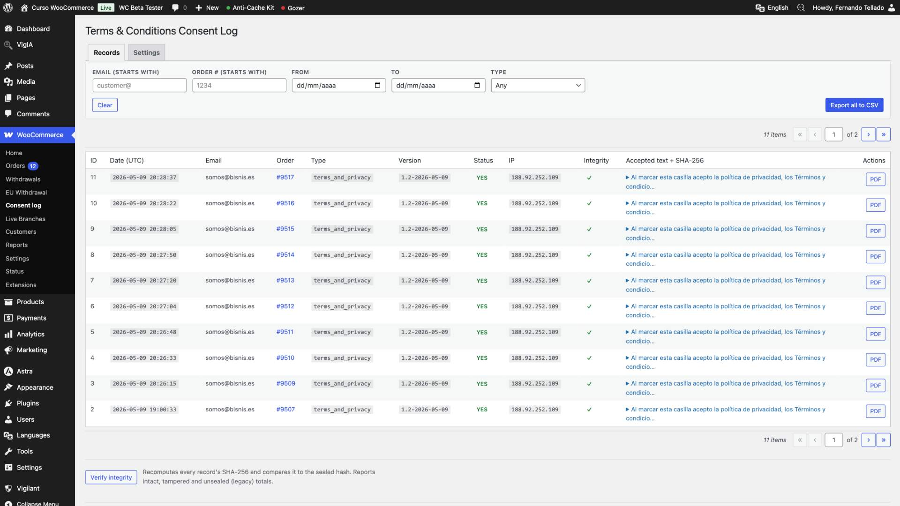
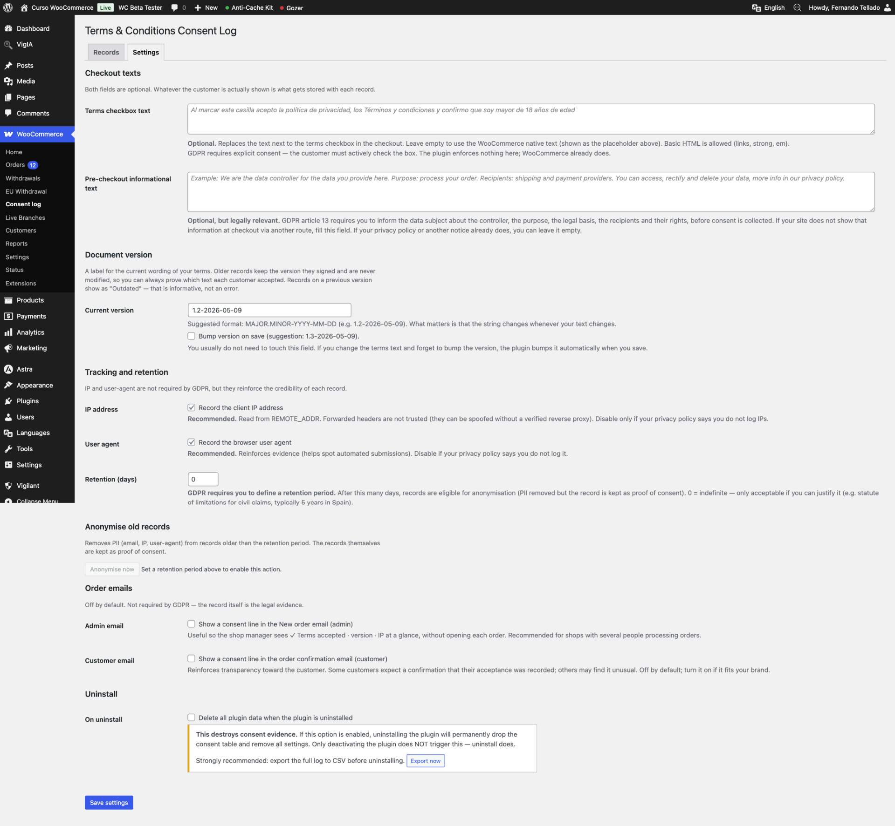
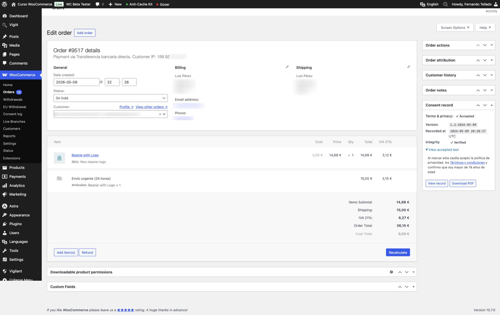
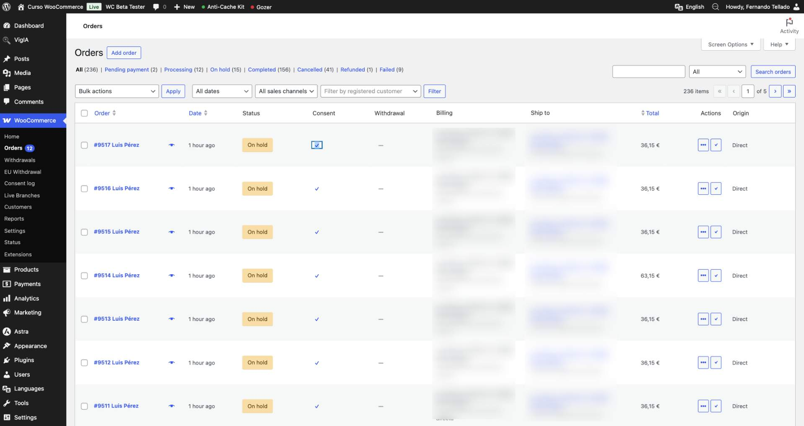
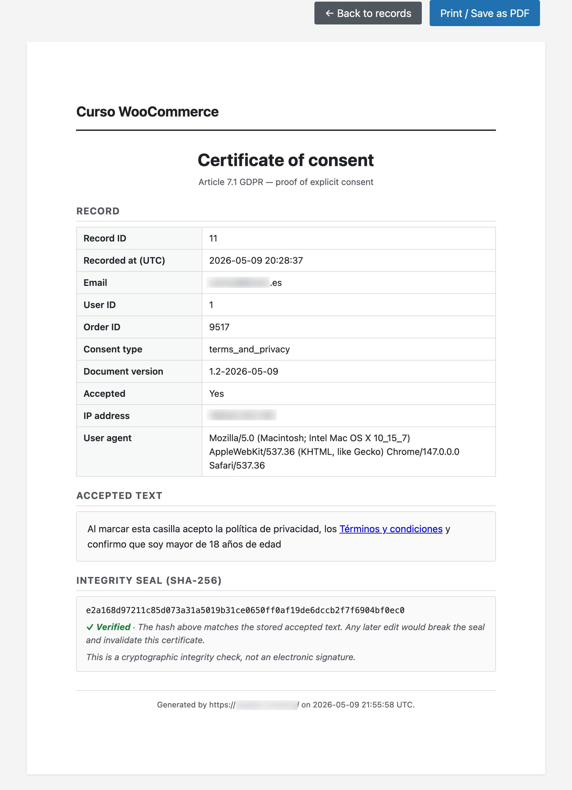
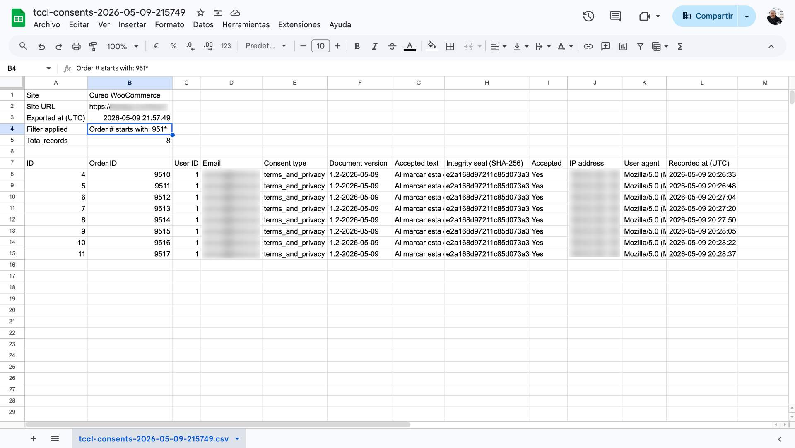

# Terms & Conditions Consent Log

> 🇬🇧 English (you are here) · [🇪🇸 Versión en español](#-versión-en-español)

[](https://www.gnu.org/licenses/gpl-2.0.html)


> ## 📦 Submitted to WordPress.org
>
> This plugin has been submitted to the official WordPress.org plugin directory and is currently awaiting review.
>
> **If you already have it installed from this repo:** no action needed. Once the plugin is approved and published on WordPress.org, the next version will appear as a normal update in **Dashboard → Updates** within a few hours, because WordPress detects updates by plugin slug.
>
> This notice will be replaced once the plugin is live on WordPress.org.

A WordPress plugin that turns any acceptance checkbox — at the WooCommerce checkout, in a Contact Form 7 form, in the WordPress comments form or in a stand-alone shortcode/block — into defensible GDPR evidence. Works with **or without** WooCommerce.

Article 7.1 of the GDPR asks for more than a boolean: timestamp, IP, user agent, the document version in force at that moment and the exact text the user was shown. This plugin captures all of it in a dedicated indexed table, seals each record with a SHA-256 hash so any later edit is detectable, integrates with the native WordPress Privacy Tools and produces a one-page printable A4 certificate per record (your browser exports it to PDF in one click).

## Features

- **Works with or without WooCommerce.** When WooCommerce is active, the plugin captures the native terms checkbox at checkout exactly as before. When it is not, the plugin still installs cleanly and lives under `Users → Consent log`.
- **WooCommerce checkout capture** — timestamp UTC, IP, user agent, document version, source URL and the exact text shown to the customer.
- **Contact Form 7 integration (opt-in)** — automatic capture of any submitted form that contains an `[acceptance]` field ticked by the visitor. One `consent_type` per form (`cf7_form_{ID}`) so records remain filterable per form.
- **WordPress comments integration (opt-in)** — logs the native `wp-comment-cookies-consent` checkbox (introduced in WP 4.9.6) when the visitor opts in.
- **`[tccl_consent_box]` shortcode and Gutenberg block** — drop a self-contained consent checkbox anywhere (page, post, widget area, HTML field of a form builder…). Submission posts to a REST endpoint and writes a record. No code required.
- **Public API** — `tccl_save_consent()` to log consents from custom flows, plugins, REST endpoints, etc.
- **Custom indexed table** — no `wp_postmeta` bloat.
- **Tamper-evident**: every record is sealed with a SHA-256 hash of the accepted text the moment it is written. Any later change to the stored text breaks the seal and is reported as `TAMPERED` in the records list, in the order metabox and on the certificate view.
- **Printable A4 certificate** per record, with a built-in "Print / Save as PDF" button — your browser exports the certificate to PDF natively, no external library bundled.
- **Native Privacy Tools integration** — `Tools > Export Personal Data` and `Tools > Erase Personal Data` both include consent records. Erasure anonymises rather than deletes, since the record itself is the lawful basis to keep the proof.
- **Both checkout texts are optional** — the WooCommerce checkbox text and the pre-checkout informational paragraph default to empty, so a fresh install respects the WooCommerce native text. Whatever the customer is actually shown is what gets stored.
- **Live partial-match filters** (email, order, date range, type) with debounced auto-submit and filtered CSV export.
- **Configurable retention** with one-click anonymise (records kept; PII scrubbed). Anonymise filtered results from the Records tab.
- **Optional consent line in WooCommerce order emails** (admin and customer, both off by default).
- **Optional plugin-data deletion on uninstall** (off by default — uninstalling does not destroy consent evidence unless you explicitly opt in).
- **HPOS** (custom order tables) compatible.
- **Translation ready** — Spanish (es_ES) bundled.

## Installation

### From a release ZIP

1. Download the ZIP from the [latest Release](https://github.com/fernandot/terms-conditions-consent-log/releases/latest).
2. WordPress admin → Plugins → Add New → Upload Plugin.
3. Activate.

### From a clone

```bash
cd wp-content/plugins
git clone https://github.com/fernandot/terms-conditions-consent-log.git
```

Activate from `Plugins` in the admin.

### Coming soon

WordPress.org listing.

## Quick start

After activation, the plugin lives under `WooCommerce → Consent log` if WooCommerce is active, or under `Users → Consent log` otherwise. The Records tab works in both cases.

1. Open the **Settings** tab and set the document version (format `MAJOR.MINOR-YYYY-MM-DD`) — the plugin auto-bumps it when the WooCommerce checkbox text changes.
2. In the **Integrations** section, enable the sources you want to capture: WordPress comments, Contact Form 7 (only shown if CF7 is active), or just rely on the `[tccl_consent_box]` shortcode/block.
3. (WooCommerce only) Optionally edit the checkbox text and add a pre-checkout informational paragraph (GDPR notice).
4. Trigger a test acceptance from each source you enabled. Open the **Records** tab to see the log, filter by `consent_type`, export, verify integrity or open the printable certificate of any record.

## Working with or without WooCommerce

The plugin recognises four sources of consent. Pick the ones that apply to your site:

### A. WooCommerce checkout (auto when WooCommerce is active)

Nothing to configure — the plugin captures the native terms checkbox at checkout as soon as it is activated. The `consent_type` is `terms_and_privacy` and the recorded text is whatever the customer was shown (the WooCommerce default, or your custom text if you set one).

### B. Contact Form 7 (opt-in)

1. Open `Consent log → Settings → Integrations`.
2. Tick **Log every CF7 form submission that ticks an `[acceptance]` field**.
3. In the CF7 form editor, make sure your forms include an acceptance field. Example:
   ```
   [acceptance privacy] I have read and agree to the privacy policy. [/acceptance]
   ```
4. From now on, whenever a visitor submits the form with the acceptance ticked, the plugin records a consent of type `cf7_form_{ID}` (one type per form). The first email field of the form is used as the subject email.

No code, no snippets, no `functions.php` edits.

### C. WordPress comments (opt-in)

1. Open `Consent log → Settings → Integrations`.
2. Tick **Log consent when a visitor leaves a comment with the native checkbox ticked**.
3. The plugin uses the WordPress 4.9.6+ `wp-comment-cookies-consent` checkbox already shown under the comment form in most themes. Each ticked submission becomes a record of type `comment_consent`, keyed by the commenter's email.

### D. `[tccl_consent_box]` shortcode and block (always available)

A self-contained checkbox you can drop anywhere — page, post, widget area, HTML field of a form builder, footer block, etc.

```
[tccl_consent_box text="I have read and agree to the <a href='/privacy'>privacy policy</a>." consent_type="newsletter_signup"]
```

Or with no attributes (uses the defaults):

```
[tccl_consent_box]
```

Available attributes:

| Attribute | Default | Notes |
|---|---|---|
| `text` | Falls back to the **Consent box default text** from `Consent log → Settings → Integrations`, then to a generic privacy line | Text shown next to the checkbox. Basic HTML allowed. May also be passed as the inner content of the shortcode. |
| `consent_type` | `consent_box` | Slug stored with each record. Use a different value per use case (e.g. `newsletter_signup`, `book_download`). |
| `consent_version` | Plugin global | Document version label. Leave empty to inherit. |
| `submit_label` | `Accept` | Submit button label. |
| `success` | Localised "Thank you, your acceptance has been recorded." | Message shown after a successful submit. |
| `require_email` | `auto` | `auto` requires email only when the visitor is not logged in. `yes` always asks. `no` never asks (only meaningful for logged-in users). |

The block is called **Consent box** and lives under the *Widgets* category. Inserting it shows an editable preview; live behaviour (submit, REST call) only runs on the front-end.

**Where it makes sense to paste the shortcode**

- A page or post with an explanatory paragraph above it.
- A sidebar or footer widget area.
- The HTML/Custom HTML field of a form builder (Gravity Forms HTML field, WPForms HTML field, Fluent Forms Custom HTML, etc.) when you want a single record per form, not per acceptance field.
- Any plugin that exposes a *custom text / extra HTML* field that allows shortcodes.

**Where you should NOT paste it (important)**

- **Not as a substitute for the cookie checkbox of a cookie/consent banner plugin** (Complianz, CookieYes, Cookie Notice, Real Cookie Banner…). Even if it technically works, the legal context is different: the cookie banner is governed by the ePrivacy Directive and refers to *cookies*; this consent log is meant for *specific consents to specific personal-data processing* (GDPR art. 7.1). Mixing them yields ambiguous evidence. If your cookie plugin keeps its own log, leave that responsibility to it.
- In forms whose consent text changes dynamically — the shortcode stores the HTML it renders, so the text must be static.

### E. From your own code

If your form is built with anything else (Gravity Forms, WPForms, Fluent Forms, custom flows, REST endpoints…), call the public function from the hook your plugin exposes:

```php
add_action( 'gform_after_submission', function ( $entry, $form ) {
    if ( ! empty( $entry['1.1'] ) ) { // ID of your consent checkbox in the entry.
        tccl_save_consent( array(
            'email'           => sanitize_email( $entry['2'] ?? '' ), // ID of the email field.
            'consent_type'    => 'gravity_form_' . absint( $form['id'] ),
            'consent_version' => '1.0-2026-05-10',
            'consent_text'    => 'I have read and agree to the privacy policy.',
            'consent_value'   => 1,
        ) );
    }
}, 10, 2 );
```

Same idea for `wpforms_process_complete`, `fluentform/submission_inserted`, `user_register`, etc.

## Screenshots

Stored under [`screenshots/`](screenshots/) and excluded from the WordPress.org release ZIP.

| | |
|:---:|:---:|
|  |  |
| Records list with live filters, integrity column and CSV export. | Settings tab with editable texts, version control, retention, email options and uninstall control. |
|  |  |
| Order metabox with consent summary, integrity badge and certificate button. | Consent column on the orders list. |
|  |  |
| Printable A4 certificate (the browser saves it as PDF). | Exported CSV file with metadata header and translated column names. |

## FAQ

**Can I use the plugin without WooCommerce?**
Yes. Activate it on any WordPress site and the menu appears under `Users → Consent log`. The Records, Settings, CSV export, PDF certificate and Privacy Tools integration all work the same way. The WooCommerce-specific bits (checkout capture, order metabox, order list column, order email line) only load when WooCommerce is active.

**Does it support the WooCommerce Block Checkout?**
Not yet. Classic checkout is fully supported. Block Checkout is on the roadmap.

**Where is the data stored?**
In a dedicated, indexed table `wp_tccl_consents`. When WooCommerce is active, three meta keys (`_tccl_terms_accepted`, `_tccl_terms_version`, `_tccl_recorded_at`) on each order mirror the summary so the order edit screen does not need to query the log table.

**Does the `[tccl_consent_box]` shortcode replace my cookie banner?**
No. They cover different legal scenarios. The cookie banner (Complianz, CookieYes, Real Cookie Banner…) is governed by the ePrivacy Directive and refers to cookies. The consent log records explicit consents to specific personal-data processing (GDPR art. 7.1). Use them in parallel, not as substitutes.

**Are WordPress comment opt-ins logged automatically?**
No. They are off by default. Enable them in `Consent log → Settings → Integrations`. Only comments where the visitor ticks the native "Save my name, email, and website…" checkbox are recorded.

**What happens if I disable WooCommerce after recording orders with consent?**
The records remain intact. Order links in the Records tab show as plain `#1234` text instead of clickable links, and a notice appears at the top of the tab to remind you. Reactivate WooCommerce and links work again.

**What happens if I uninstall the plugin?**
By default, nothing is deleted. The consent evidence survives uninstall. Only if you explicitly enable "Delete all data on uninstall" in Settings does the table get dropped.

**Does the plugin trust forwarded IP headers?**
No. It reads `REMOTE_ADDR` only — forwarded headers can be spoofed without a verified reverse proxy. If your hosting puts the proxy IP in `REMOTE_ADDR`, you will record the proxy IP for every customer.

**Is the certificate a real PDF?**
The plugin renders a one-page A4 view with print-optimised CSS and a "Print / Save as PDF" button. Modern browsers (Chrome, Safari, Firefox, Edge) export that view to a real PDF natively — same fidelity as a server-side library would produce, with the added benefit that it respects your site's language and fonts. No external library bundled, so the plugin stays small.

## Roadmap

Top priorities for the next versions:

1. **More form-builder integrations** — Gravity Forms, WPForms, Fluent Forms, Forminator and Elementor Forms (same automatic-capture pattern as Contact Form 7).
2. **WordPress login and registration capture** — opt-in hooks on `wp_login` and `user_register`.
3. **WooCommerce login and registration capture** — opt-in hooks on `woocommerce_login_form`, `woocommerce_register_form` and `woocommerce_created_customer`.

Other items, no fixed order: WooCommerce Block Checkout (when it leaves beta), version history and diff viewer for the legal text, multiple configurable consent checkboxes per source, read REST API endpoints, WP-CLI commands, HMAC-SHA-256 sealing with installation secret, hash chain between records, scheduled integrity checks via WP-Cron, consent withdrawal flag, `[tccl_my_consents]` shortcode for the data subject, webhook out, dashboard widget, more form-builder and newsletter integrations, CCPA / LGPD / POPIA exporters, continuous integration (WPCS, Plugin Check, PHPUnit), more translations (fr_FR, de_DE, it_IT, pt_BR).

## Contributing

Issues, ideas and pull requests are welcome. Please open an issue first if you plan a non-trivial change.

## License

GPL-2.0-or-later. See [LICENSE](LICENSE).

---

## 🇪🇸 Versión en español

> [🇬🇧 English version](#terms--conditions-consent-log) · 🇪🇸 Español (aquí estás)

> ## 📦 Enviado a WordPress.org
>
> Este plugin se ha enviado al directorio oficial de plugins de WordPress.org y está pendiente de revisión.
>
> **Si ya lo tienes instalado desde este repositorio:** no tienes que hacer nada. Cuando el plugin se apruebe y publique en WordPress.org, la siguiente versión aparecerá como actualización normal en **Escritorio → Actualizaciones** en pocas horas, porque WordPress detecta las actualizaciones por el slug del plugin.
>
> Este aviso se sustituirá cuando el plugin esté publicado en WordPress.org.

Plugin de WordPress que convierte cualquier casilla de aceptación — la del pago de WooCommerce, de un formulario de Contact Form 7, la de los comentarios de WordPress o de un shortcode/bloque propio, en una prueba de consentimiento defendible bajo el RGPD. Funciona **con o sin** WooCommerce.

El artículo 7.1 del RGPD pide más que un booleano: fecha y hora, IP, user-agent, versión del documento en vigor en ese momento y el texto exacto que vio el usuario. Este plugin captura todo eso en una tabla propia indexada, sella cada registro con un hash SHA-256 para detectar cualquier modificación posterior, se integra con las Herramientas de Privacidad nativas de WordPress y genera un certificado A4 imprimible por registro (tu navegador lo guarda como PDF en un clic).

### Características

- **Funciona con o sin WooCommerce.** Si WooCommerce está activo, el plugin captura la casilla de aceptación de los términos y condiciones del pago exactamente igual que antes. Si no, el plugin se instala sin problemas y aparece bajo `Usuarios → Registro de consentimientos`.
- **Captura del checkout de WooCommerce** — fecha y hora UTC, IP, user-agent, versión del documento, URL de origen y el texto exacto mostrado al cliente.
- **Integración con Contact Form 7 (opt-in)** — captura automática de cualquier formulario que tenga un campo `[acceptance]` marcado por el visitante. Un `consent_type` por formulario (`cf7_form_{ID}`) para que los registros sigan filtrables por formulario.
- **Integración con comentarios de WordPress (opt-in)** — registra la casilla de aceptación nativa `wp-comment-cookies-consent` (introducida en WP 4.9.6) cuando el visitante la marca.
- **Shortcode y bloque Gutenberg `[tccl_consent_box]`** — pega una casilla de consentimiento completa propia en cualquier sitio (página, entrada, área de widgets, campo HTML de un maquetador de formularios…). Al enviarse va a un endpoint REST y registra el consentimiento. Sin código.
- **API pública** — `tccl_save_consent()` para registrar consentimientos desde flujos personalizados, plugins, endpoints REST, etc.
- **Tabla custom indexada** — sin saturar `wp_postmeta`.
- **A prueba de manipulación**: cada registro se sella con un hash SHA-256 del texto aceptado en el momento del consentimiento. Cualquier cambio posterior del texto rompe el sello y se reporta como `MANIPULADO` en el listado, en la caja meta del pedido y en la vista del certificado.
- **Certificado A4 imprimible** por registro, con botón "Imprimir / Guardar como PDF" — el navegador lo exporta a PDF de forma nativa, sin librerías externas en el plugin.
- **Integración nativa con Herramientas de Privacidad** — `Herramientas > Exportar datos personales` y `Herramientas > Borrar datos personales` incluyen los consentimientos. El borrado anonimiza (no elimina), porque el propio registro es la base legítima para conservar la prueba.
- **Ambos textos del pago son opcionales** — el de la casilla de aceptación y el párrafo informativo previo al pago vienen vacíos por defecto, así una instalación nueva respeta el texto nativo de WooCommerce. Lo que ve el cliente es lo que se guarda.
- **Filtros de búsqueda parcial en vivo** (email, pedido, rango de fechas, tipo) con auto-envío con límite de frecuencia (debounce) y exportación CSV filtrada.
- **Retención configurable** con anonimización en un clic (los registros se conservan; los datos personales se borran). Anonimización por filtro desde la pestaña de registros.
- **Línea de consentimiento opcional en los emails de WooCommerce** (admin y cliente, ambas desactivadas por defecto).
- **Eliminación de datos al desinstalar opcional** (desactivado por defecto — desinstalar no destruye la prueba salvo que lo actives explícitamente).
- **Compatible con HPOS** (custom order tables).
- **Listo para traducción** — incluye traducción al español (es_ES).

### Instalación

#### Desde un ZIP de Release

1. Descarga el ZIP desde la [última Release](https://github.com/fernandot/terms-conditions-consent-log/releases/latest).
2. Admin de WordPress → Plugins → Añadir nuevo → Subir plugin.
3. Activa.

#### Desde un clon

```bash
cd wp-content/plugins
git clone https://github.com/fernandot/terms-conditions-consent-log.git
```

Activa desde `Plugins` en el admin.

#### Próximamente

Listado en WordPress.org.

### Inicio rápido

Tras activar, el plugin vive bajo `WooCommerce → Registro de consentimientos` si WooCommerce está activo, o bajo `Usuarios → Registro de consentimientos` si no. La pestaña de registros funciona igual en ambos casos.

1. Abre la pestaña **Ajustes** y define la versión del documento (formato `MAJOR.MINOR-YYYY-MM-DD`) — el plugin la incrementa automáticamente cuando cambia el texto de la casilla de aceptación de WooCommerce.
2. En la sección **Integraciones**, activa las fuentes de las que quieras capturar consentimiento: comentarios, Contact Form 7 (solo aparece si CF7 está activo) o limítate a usar el shortcode/bloque `[tccl_consent_box]`.
3. (Solo WooCommerce) Opcionalmente edita el texto de la casilla y añade un párrafo informativo previo al finalizar compra (aviso RGPD).
4. Provoca una aceptación de prueba desde cada fuente activada. Abre la pestaña **Registros** para ver el log, filtrar por `consent_type`, exportar, verificar integridad o abrir el certificado imprimible de cualquier registro.

### Funcionando con o sin WooCommerce

El plugin reconoce cuatro fuentes de consentimiento. Usa las que apliquen a tu sitio:

#### A. Finalizar compra de WooCommerce (automático si WooCommerce está activo)

Sin configuración — al activarse, el plugin captura el checkbox nativo de términos del checkout. El `consent_type` es `terms_and_privacy` y el texto guardado es exactamente lo que vio el cliente (el texto por defecto de WooCommerce, o el tuyo si has personalizado).

#### B. Contact Form 7 (opt-in)

1. Ve a `Registro de consentimientos → Ajustes → Integraciones`.
2. Marca **Registrar cada envío de CF7 que marque un campo `[acceptance]`**.
3. En el editor de CF7, asegúrate de que tus formularios incluyen un campo de aceptación. Ejemplo:
   ```
   [acceptance privacy] He leído y acepto la política de privacidad. [/acceptance]
   ```
4. A partir de ahí, cada vez que un visitante envíe el formulario con la aceptación marcada, el plugin guarda un consentimiento de tipo `cf7_form_{ID}` (un tipo por formulario). El primer campo de email del formulario se usa como email del sujeto.

Sin código, sin snippets, sin tocar `functions.php`.

#### C. Comentarios de WordPress (opt-in)

1. Ve a `Registro de consentimientos → Ajustes → Integraciones`.
2. Marca **Registrar consentimiento cuando un visitante deja un comentario con la casilla nativa marcada**.
3. El plugin usa la casilla de aceptación `wp-comment-cookies-consent` que WordPress 4.9.6+ añade bajo el formulario de comentarios en la mayoría de temas. Cada envío con la casilla marcada se guarda como registro de tipo `comment_consent`, con el email del comentarista.

#### D. Shortcode y bloque `[tccl_consent_box]` (siempre disponible)

Una casilla propia completa que puedes pegar donde quieras: página, entrada, widget, campo HTML de un maquetador de formularios, pie de página, etc.

```
[tccl_consent_box text="He leído y acepto la <a href='/privacidad'>política de privacidad</a>." consent_type="newsletter_signup"]
```

O sin atributos (usa los valores por defecto):

```
[tccl_consent_box]
```

Atributos disponibles:

| Atributo | Default | Notas |
|---|---|---|
| `text` | Recurre al **Texto por defecto del consent box** de `Registro de consentimientos → Ajustes → Integraciones` y, si está vacío, a una frase genérica de privacidad | Texto mostrado junto a la casilla. Admite HTML básico. También se puede pasar como contenido del shortcode. |
| `consent_type` | `consent_box` | Slug que se guarda en el registro. Usa un valor distinto por caso de uso (`newsletter_signup`, `descarga_ebook`…). |
| `consent_version` | Versión global del plugin | Etiqueta de versión del documento. Vacío para heredar. |
| `submit_label` | `Aceptar` | Texto del botón de envío. |
| `success` | "Gracias, hemos registrado tu aceptación." | Mensaje al enviar correctamente. |
| `require_email` | `auto` | `auto` pide email solo si el visitante no está logueado. `yes` siempre lo pide. `no` nunca lo pide (solo útil para usuarios conectados). |

El bloque se llama **Casilla de consentimiento** y está en la categoría *Widgets*. Al insertarlo muestra una vista previa editable; el comportamiento real (envío, REST) solo funciona en la parte visible de la web.

**Dónde tiene sentido pegarlo**

- En una página o entrada con un párrafo explicativo encima.
- En un widget de barra lateral o área de footer.
- En un campo HTML/Custom HTML de un maquetador de formularios (Gravity Forms, WPForms, Fluent Forms…) cuando quieras un único registro por formulario, no uno por campo de aceptación.
- En cualquier plugin que permita pegar HTML o shortcodes en un campo de "texto extra".

**Dónde NO conviene pegarlo (importante)**

- **No lo uses como sustituto de la aceptación de cookies de un plugin de cookies/banners** (Complianz, CookieYes, Cookie Notice, Real Cookie Banner…). Aunque técnicamente se puede, el contexto legal es distinto: el banner de cookies se rige por la directiva ePrivacy y trata sobre cookies; este registro es para *consentimientos específicos a tratamientos concretos de datos personales* (RGPD art. 7.1). Mezclarlos da una prueba ambigua. Si tu plugin de cookies guarda su propio log, déjale a él esa función.
- En formularios donde el texto del consentimiento cambie dinámicamente. El shortcode guarda el HTML que procesa, así que el texto debe ser estático.

#### E. Desde tu propio código

Si tu formulario está hecho con cualquier otra cosa (Gravity Forms, WPForms, Fluent Forms, flujos custom, endpoints REST…), llama a la función pública desde el hook que exponga ese plugin:

```php
add_action( 'gform_after_submission', function ( $entry, $form ) {
    if ( ! empty( $entry['1.1'] ) ) { // ID de tu checkbox de consentimiento.
        tccl_save_consent( array(
            'email'           => sanitize_email( $entry['2'] ?? '' ), // ID del campo de email.
            'consent_type'    => 'gravity_form_' . absint( $form['id'] ),
            'consent_version' => '1.0-2026-05-10',
            'consent_text'    => 'He leído y acepto la política de privacidad.',
            'consent_value'   => 1,
        ) );
    }
}, 10, 2 );
```

Mismo patrón con `wpforms_process_complete`, `fluentform/submission_inserted`, `user_register`, etc.

### Capturas

Guardadas en [`screenshots/`](screenshots/) y excluidas del ZIP que se publica en WordPress.org.

| | |
|:---:|:---:|
|  |  |
| Listado de registros con filtros en vivo, columna de integridad y exportación CSV. | Pestaña Ajustes con textos editables, control de versión, retención, emails y desinstalación. |
|  |  |
| Metabox del pedido con resumen, badge de integridad y botón al certificado. | Columna Consentimiento en el listado de pedidos. |
|  |  |
| Certificado A4 imprimible (el navegador lo guarda como PDF). | CSV exportado con cabecera de metadatos y columnas traducidas. |

### Preguntas frecuentes

**¿Puedo usar el plugin sin WooCommerce?**
Sí. Actívalo en cualquier WordPress y el menú aparece bajo `Usuarios → Registro de consentimientos`. Los registros, los ajustes, la exportación CSV, el certificado PDF y la integración con las Herramientas de Privacidad funcionan igual. Las piezas específicas de WooCommerce (captura en el pago, caja meta del pedido, columna en el listado de pedidos, línea en los emails de pedido) solo se cargan si WooCommerce está activo.

**¿Es compatible con los bloques de pago del editor Gutenberg de WooCommerce?**
Aún no. El pago clásico está totalmente contemplado. El de bloques está en la hoja de ruta.

**¿Dónde se guardan los datos?**
En una tabla propia indexada `wp_tccl_consents`. Si WooCommerce está activo, tres meta del pedido (`_tccl_terms_accepted`, `_tccl_terms_version`, `_tccl_recorded_at`) duplican el resumen para que la pantalla de edición del pedido no consulte la tabla de log.

**¿El shortcode `[tccl_consent_box]` reemplaza al banner de cookies?**
No. Cubren escenarios legales distintos. El banner de cookies (Complianz, CookieYes, Real Cookie Banner…) se rige por la directiva ePrivacy y va de cookies. El registro de consentimientos guarda consentimientos explícitos a tratamientos concretos de datos personales (RGPD art. 7.1). Úsalos en paralelo, no como sustitutos.

**¿Se registran automáticamente las aceptaciones de comentarios de WordPress?**
No. Vienen desactivadas. Actívalo en `Registro de consentimientos → Ajustes → Integraciones`. Solo se registran los comentarios donde el visitante marca la casilla nativa "Guarda mi nombre, correo y web…".

**¿Qué pasa si desactivo WooCommerce después de tener pedidos con consentimiento registrado?**
Los registros se conservan intactos. Los enlaces a pedidos en la pestaña de registros se muestran como `#1234` en texto plano en lugar de enlaces, y aparece un aviso al inicio de la pestaña recordándolo. Reactiva WooCommerce y los enlaces vuelven a funcionar.

**¿Qué pasa si desinstalo el plugin?**
Por defecto no se borra nada. La prueba del consentimiento sobrevive a la desinstalación. Solo si activas explícitamente "Borrar todos los datos al desinstalar" en Ajustes se elimina la tabla.

**¿El plugin se fía de las cabeceras IP reenviadas?**
No. Solo lee `REMOTE_ADDR` — las cabeceras reenviadas se pueden falsear sin un proxy inverso verificado. Si tu hosting deja la IP del proxy en `REMOTE_ADDR`, vas a guardar la del proxy para todos los clientes.

**¿El certificado es un PDF real?**

El plugin entrega una vista A4 de una página con CSS optimizado para impresión y un botón "Imprimir / Guardar como PDF". Los navegadores modernos (Chrome, Safari, Firefox, Edge) exportan esa vista a un PDF de verdad, de forma nativa, con la misma fidelidad que daría una librería en servidor, y con la ventaja de respetar el idioma y las tipografías de tu sitio. El plugin no carga librerías externas, y así se mantiene ligero.
### Roadmap

Prioridades inmediatas para las próximas versiones:

1. **Más integraciones con formularios** — Gravity Forms, WPForms, Fluent Forms, Forminator y Elementor Forms (mismo patrón de captura automática que Contact Form 7).
2. **Captura del login y del registro de WordPress** — hooks de aceptación(opt-in) en `wp_login` y `user_register`.
3. **Captura del login y del registro de WooCommerce** — hooks de aceptación (opt-in) en `woocommerce_login_form`, `woocommerce_register_form` y `woocommerce_created_customer`.

Otras ideas, sin orden fijo: Bloques de finalizar compra de WooCommerce (cuando salga de beta), histórico de versiones y visor de diff del texto legal, múltiples casillas de consentimiento configurables por fuente, endpoints REST API de lectura, comandos de WP-CLI, sello HMAC-SHA-256 con secret de instalación, cadena de hashes entre registros, verificación de integridad automática vía WP-Cron, registro de retirada de consentimiento, shortcode `[tccl_my_consents]` para el sujeto, webhook saliente, widget de escritorio, más integraciones con maquetadores de formularios y newsletters, exportadores CCPA / LGPD / POPIA, integración continua (WPCS, Plugin Check, PHPUnit), más traducciones (fr_FR, de_DE, it_IT, pt_BR).

### Contribuir

Se agradecen reportes de issues e ideas. Si quieres un cambio no trivial, abre una issue antes de liarte.

### Licencia

GPL-2.0-or-later. Ver [LICENSE](LICENSE).